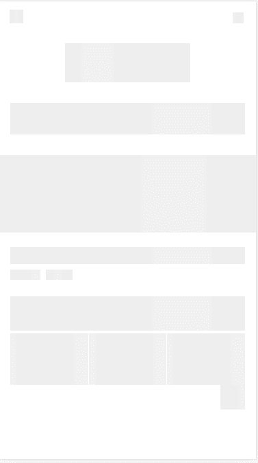

# vue 骨架屏实现

## 前言

为了前端体验更加友好，减缓用户的焦虑情绪，提升项目质量等，我们在项目里面可以使用骨架屏，提前渲染出来一个跟正式页面相似的页面出来，减小首屏加载时间。

## 在 vue 中使用骨架屏

因为我们的代码会使用 webpack 打包，所以在我们的 js 下载运行之前，用户是无法在页面上看到信息，这是所谓的白屏时间，如果通过 webpack 把骨架屏页面替换到初始化的 DOM 节点，用户一进来看到不再是白屏，而是页面的基本框架，等到我们页面 js 加载、数据请求完成。将页面的 DOM 节点替换，这样能提升用户的体验。

## 骨架屏的原理

我们 vue 页面的加载是首先加载`html`文件，再处理`js`文件，那么我们只要在打包后的 dist 目录下的`html`文件内的`<div id='app'></div>`标签内写入我们的骨架屏，那么在等 vue 加载处理资源、请求完后，生成 DOM 的将会替换`<div id='app'></div>`标签内的内容，这样在 vue 加载处理资源、请求时间内，用户看到的是我们设置的骨架屏，而不是白屏，从而在视觉上减少了显示白屏时间。

```html
<div id="app">
  <!-- 骨架屏页面代码 -->
</div>
```

## 骨架屏的简单实现

主要步骤：1、创建与页面相识的 html 结构（这里推荐一个前端的爬虫工具[puppeteer](https://github.com/GoogleChrome/puppeteer)）2、在获取到相对应的 html 结构后添加背景色，插入`<div id='app'></div>`标签内
### 案例（爬了m端百度的首页）



### html

```html
<div id="app">
  <div
    class="_ __"
    style="height:100%;display:none;z-index:990;background:#fff"
  ></div>
  <div
    class="_"
    style="height:2.399%;top:2.399%;left:90.933%;width:4.267%"
  ></div>
  <div
    class="_"
    style="height:8.546%;top:9.145%;left:25.554%;width:48.888%"
  ></div>
  <div
    class="_"
    style="height:6.897%;top:22.189%;left:4.267%;width:91.467%"
  ></div>
  <div
    class="_"
    style="height:1.649%;top:35.832%;left:93.067%;width:2.933%"
  ></div>
  <div
    class="_"
    style="height:16.942%;top:33.583%;left:0.000%;width:100.000%"
  ></div>
  <div
    class="_"
    style="height:2.999%;top:1.799%;left:4.000%;width:5.333%"
  ></div>
  <div
    class="_"
    style="height:3.748%;top:53.673%;left:4.267%;width:91.467%"
  ></div>
  <div
    class="_"
    style="height:2.249%;top:58.621%;left:4.267%;width:11.733%"
  ></div>
  <div
    class="_"
    style="height:2.249%;top:58.621%;left:18.133%;width:10.400%"
  ></div>
  <div
    class="_"
    style="height:7.496%;top:64.468%;left:4.267%;width:91.467%"
  ></div>
  <div
    class="_"
    style="height:11.308%;top:72.564%;left:4.267%;width:30.279%"
  ></div>
  <div
    class="_"
    style="height:11.308%;top:72.564%;left:34.813%;width:30.279%"
  ></div>
  <div
    class="_"
    style="height:11.308%;top:72.564%;left:65.358%;width:30.279%"
  ></div>
  <div
    class="_"
    style="height:5.697%;top:83.571%;left:86.133%;width:9.600%"
  ></div>
</div>
```

### css

```css
._ {
  position: fixed;
  z-index: 999;
  background: linear-gradient(
      90deg,
      rgba(255, 255, 255, 0.15) 25%,
      transparent 25%
    ) #eee;
  animation: skeleton-stripes 1s linear infinite;
}
.__ {
  top: 0%;
  left: 0%;
  width: 100%;
}
@keyframes skeleton-stripes {
  from {
    background-position: 0 0;
  }
  to {
    background-position: 20rem 0;
  }
}
```
## 总结
前端优化仿佛是一种无止境的探索，尤其是现在产品对于用户体验的重视，任何一点体验的改善与提升都会增加用户的友好度，最终使产品留下一个好印象。